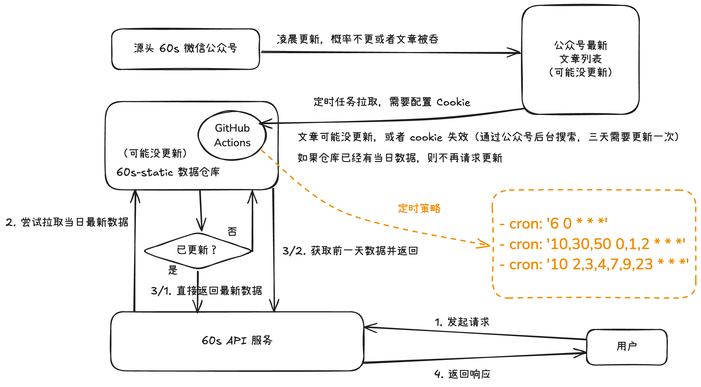

# ⏰ 60s API

      [](https://qm.qq.com/q/RpJXzgfAMG)

<a href="https://hellogithub.com/repository/vikiboss/60s" target="_blank" ref="noreferrer noopener" ></a>

一系列 **高质量、开源、可靠、全球 CDN 加速** 的开放 API 集合，让你用最简单的方式获取最准确的数据。

构建于现代技术栈 [Deno](https://deno.com/)，托管在 [Deno Deploy](https://deno.com/deploy)，同时支持 [Docker](https://docker.com)、[Cloudflare Workers](https://www.cloudflare.com/zh-cn/developer-platform/products/workers/)、[Bun](https://bun.sh/) 和 [Node.js](https://nodejs.org/) 等多种部署方式。

## 🎯 项目起源

本项目最早源于 [这篇博客文章](https://blog.viki.moe/60s) 中提到的想法。随着项目的发展，逐渐演变成一个多功能的开放 API 平台，旨在为开发者提供便捷的数据获取方式。

## 🌍 读懂世界 · 每天 60 秒读懂世界

本项目的 **核心功能**：获取每日精选新闻，让你快速了解世界大事。

**📡 API 调用示例**

> 部分地区访问主域名可能超时，可尝试自行部署，或使用他人分享的 [公共实例](https://docs.60s-api.viki.moe/7306811m0)

```bash
# JSON 格式 (默认)
curl "https://60s.viki.moe/v2/60s"

# 纯文本格式
curl "https://60s.viki.moe/v2/60s?encoding=text"

# 原图直链 (重定向到数据仓库原图直链)
curl "https://60s.viki.moe/v2/60s?encoding=image" --location --output "$(date +%Y-%m-%d).png"

# 代理直链 (代理请求，直接返回图片二进制数据)
curl "https://60s.viki.moe/v2/60s?encoding=image-proxy" --output "$(date +%Y-%m-%d).png"
```

**📊 数据特性**

- **数据源**: 微信公众号，详情参考 [这里](https://github.com/vikiboss/60s-static-host/blob/main/src/constants.ts#L4-L12)
- **更新频率**: 每半小时自动尝试更新，正常情况最晚上午 10 点会更新
- **数据处理**: [vikiboss/60s-static-host](https://github.com/vikiboss/60s-static-host) 仓库定时抓取
- **响应速度**: 毫秒级缓存响应，全球 CDN 加速
- **内容质量**: 精选 15 条国内外优质新闻 + 每日微语

**💡 使用场景**

- 📱 移动应用新闻模块
- 🖥️ 网站首页资讯展示  
- 🤖 聊天机器人新闻推送
- 📧 邮件订阅日报生成
- 🔔 桌面通知提醒

## 🤖 Agent Skills

本项目支持配合各种 AI 大模型以 Agent Skills 的方式使用，你可以在 [skills.sh](https://skills.sh/?q=vikiboss/60s-skills) 查看相关 skills，更多详情可参考 [vikiboss/60s-skills](https://github.com/vikiboss/60s-skills) 源码仓库，欢迎贡献。

## 🎯 API 设计理念

- **权威数据源** - 优先选择官方、权威的数据来源，确保信息准确性
- **毫秒级响应** - 部分接口采取智能缓存策略，用户无感的高速响应体验
- **开发者友好** - 统一的 API 设计，简洁的参数结构，完善的文档支持

## 📚 完整 API 列表与文档

完整 API 文档托管在 [Apifox](https://docs.60s-api.viki.moe)，持续更新中，欢迎贡献。

---

## 🚀 快速开始

你可以通过 [API 文档](https://docs.60s-api.viki.moe) 中提供的 [官方实例](https://60s.viki.moe) 或者 [社区公共实例](https://docs.60s-api.viki.moe/7306811m0) 快速开始。


如果你想要更多的**掌控感**和**稳定性保证**，也可以通过下面的方式自行部署。

### 📦 一键部署

**Docker 方式（推荐）**

```bash
docker run -d \
  --restart always \
  --name 60s \
  -p 4399:4399 \
  vikiboss/60s:latest
```

**其他 JS/TS 运行时（备选）**

```bash
# Deno
deno install && deno run -A deno.ts

# Bun
bun install && bun run bun.ts

# Node.js (需要 v22.6+)
npm install && node --experimental-strip-types node.ts
```

### ☁️ 云端部署

**Cloudflare Workers**

方式一，使用 Workers 的可视化界面：

1. [Fork 本仓库](https://github.com/vikiboss/60s/fork)
2. 在 [Cloudflare Workers](https://workers.cloudflare.com/) 通过 GitHub 创建项目
3. 使用默认配置直接部署

> 仓库已预置 Workers 配置，无需额外设置。后续更新只需同步主仓库即可。

方式二，命令行操作，clone 本仓库然后执行：

```bash
npm install && npx wrangler publish
```

---

## 📋 数据更新机制



### 🔄 更新策略
- **数据抓取**: GitHub Actions 定时任务
- **存储方式**: 静态 JSON 文件 + CDN 缓存  
- **更新频率**: 每日自动更新

> 可视化架构图: [60s 更新策略 - Excalidraw](https://excalidraw.com/#json=VRffPBlMuFBkOlTbGe7IH,0C6yClfLME65ZhmQ30ywdg)

---

## 🤝 社区与支持

### 🙏 致谢

本项目的部分代码、灵感、实现方式等参考了以下优秀开源项目，排名不分先后：

- [DIYgod/RSSHub](https://github.com/DIYgod/RSSHub)
- [Rankslive/RanksLiveApi](https://github.com/Rankslive/RanksLiveApi)

### 💬 交流

- **QQ 群**: [](https://qm.qq.com/q/RpJXzgfAMG) (问题反馈、使用交流)
- **GitHub**: [Issues](https://github.com/vikiboss/60s/issues) (Bug 报告、功能建议)
- **文档**: [API 文档](https://docs.60s-api.viki.moe) (详细使用说明)

### 📈 项目 Star 历史

[](https://star-history.com/#vikiboss/60s&Date)

## 💰 赞赏项目

如果觉得这个项目对你有帮助，欢迎请我喝咖啡 ☕️

> 采取**自愿**原则, 收到的赞赏将用于提高开发者积极性和开发环境。

<div id='readme-reward' style="display: flex; gap: 8px; flex-wrap: wrap; width: 100%">
  
  
</div>


<details>
<summary>感谢以下小伙伴的赞赏（点击展开/收起，排名不分先后）</summary>

<!-- 表格 -->
|           赞赏人            |  金额  |  途径  |                  备注                  |
| :-------------------------: | :----: | :----: | :------------------------------------: |
|           Update            |  6.66  | WeChat |           感谢大佬的开源分享           |
|            匿名             |  0.01  | WeChat |                   -                    |
|         月夜忆江南          |  5.00  | WeChat |                   -                    |
|            匿名             |  1.66  | WeChat |                   -                    |
|         GoooodJooB7         |  1.66  | WeChat |              谢谢大佬开源              |
|            匿名             |  1.66  | WeChat |                   -                    |
| 十七岁就学会吃饭的天才少年  |  5.00  | WeChat |                   -                    |
|          Sundrops           |  1.66  | WeChat |             感谢友友的接口             |
|        春风伴我余生         | 10.00  | WeChat |                   -                    |
|             杰              |  1.00  | WeChat |                   -                    |
|            Blue             |  6.66  | WeChat |           Blue 祝开发者 6666           |
|           聆听、            | 10.00  | WeChat |           喝杯咖啡，记得加冰           |
|            匿名             | 100.00 | WeChat |                 好项目                 |
| 卤蛋 （HelloGitHub 发起人） | 88.88  | WeChat |      很喜欢你的项目，加油 ^ O ^ ~      |
|             Lee             |  6.66  | WeChat |                感谢分享                |
|          世界和平           | 66.00  | WeChat |           世界需要更多的英雄           |
|         севастополь         |  6.66  | WeChat |                买包辣条                |
|             爪              |  2.00  | WeChat |                   -                    |
|             LMQ             | 18.80  | WeChat | 大佬的响应速度，我泪目了，请大佬喝咖啡 |
|             ---             |  ---   |  ---   |                  ---                   |
|             *斌             | 12.90  | Alipay |                   -                    |
|             *杰             | 20.00  | Alipay |                   -                    |
|            **杰             |  9.90  | Alipay |                   -                    |
|             *瑞             | 666.66 | Alipay |               100 杯咖啡               |
|             ---             |  ---   |  ---   |                  ---                   |
|             Ko.             | 11.66  |   QQ   |                   -                    |
|           yijiong           | 15.00  |   QQ   |            a cup of coffee             |

> 如有遗漏，欢迎通过 issue 或者 QQ 群 595941841 反馈。

</details>

## 🪪 License （开源协议）

[MIT](license) License © 2022-PRESENT Viki
